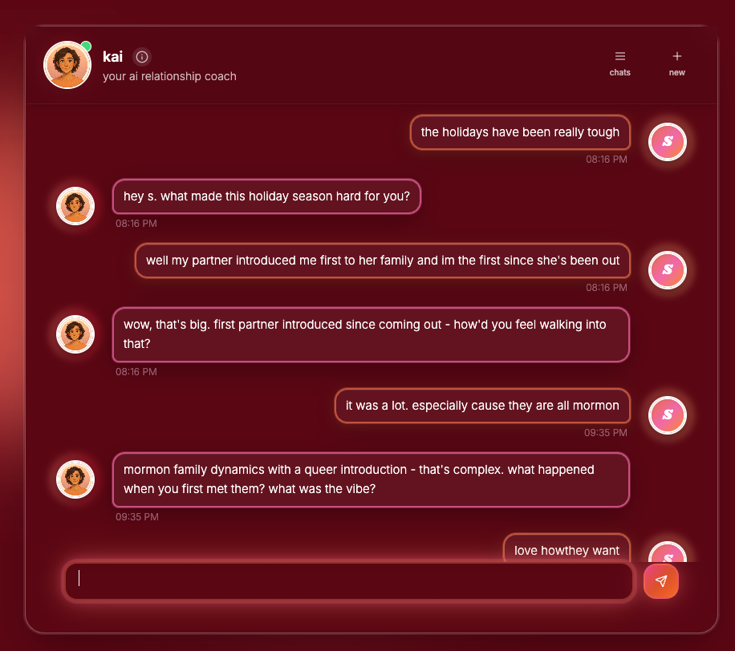

<h1> heartlines ai</h1>

**an ai relationship coach for messy, modern love.**

 

---

**for engineers:** heartlines combines profile-based context injection, structured conversation flows, and server-side ai orchestration to turn open-ended chat into deterministic, real-world actions.

**live app** · [heartlines.ai](https://heartlines.ai)

## product

<p align="center">
  
</p>

---

## why i built heartlines

i kept seeing the same moment happen, to me and to people around me.

you're staring at a text, rewriting it over and over, trying to figure out if you're overreacting or if something actually feels off. it's happening in real time, and most support just isn't there when you need it.

you either spiral on your own or wait for clarity that comes too late.

at the same time, i've seen how quickly ai becomes careless when it touches something this personal.

heartlines is my answer to that.

it's built for the messy middle, the texts, the silence, the moments that feel small but aren't. to help you slow down, make sense of what you're feeling, and find words you can actually use.

so you can show up in a way you feel good about later.

stronger relationships build stronger communities.

## core capabilities

the system moves from "what just happened?" to "what do i say?" to "what do i do next?"

- **context injection** starts with your patterns, attachment style, relationship history, and partner profiles. kai uses this to ask sharper questions without you having to re-explain.

- **conversation flow** structured phases: understand, reflect, steer, execute.

- **script co-creation** draft the text, shape the conversation, pressure-test tone and boundaries. not just advice, something you can actually say.

- **scenario-based entry points** kai starts with the moment you're in. the same fight again, the silence, the spiral, the message that feels off.

- **topic-specific playbooks** guided by structured domains: conflict and repair, intimacy, trust, family, identity, and transitions.

- **response design** concise and usable. built for texts, calls, or in-person. you leave with something to use, not more to process.

- **private by architecture** encrypted at rest. no selling or training on emotional data. server-side execution only.

## tech stack

| layer | technology |
|-------|-----------|
| frontend | React 18, TypeScript 5, Vite 5 |
| styling | Tailwind CSS 3, Radix UI (shadcn/ui) |
| state | TanStack React Query, React Context |
| backend | Supabase Edge Functions (Deno) |
| database | PostgreSQL via Supabase (RLS-secured) |
| auth | Supabase Auth (email/password, magic link) |
| ai | Anthropic Claude (server-side only) |
| payments | Stripe (subscriptions + webhooks) |
| hosting | Lovable Cloud |

## architecture highlights

- **server-side ai execution** all llm interactions run through secure edge functions. no client-side exposure of api keys or prompts.
- **row-level security** strict per-user data isolation enforced at the database layer. prevents cross-user data access by design.
- **role-based access control** admin roles isolated in dedicated tables with security definer functions to prevent privilege escalation.
- **safety and monitoring** real-time crisis detection with severity-based logging and guardrails for unsafe outputs.
- **performance and cost efficiency** prompt caching with token-level metrics and usage analytics for optimization.

## project structure

```
src/
├── components/       UI components organized by feature
├── hooks/            Custom React hooks
├── integrations/     Supabase client and generated types
├── pages/            Route-level page components
├── contexts/         React context providers
└── utils/            Shared utilities

supabase/
├── functions/        Edge Functions (AI chat, voice, payments)
└── migrations/       Database schema migrations
```

## getting started

```sh
git clone https://github.com/laurieai94/heartlines-ai.git
cd heartlines-ai
npm install
cp .env.example .env
npm run dev
```

## environment and security

client-side keys are limited to publishable/anon access. all sensitive operations are handled server-side through Supabase Edge Functions. secrets are stored as edge function environment variables and never appear in the codebase. identity data and relational data are strictly separated. see [`.env.example`](.env.example) for required variables.

## license

MIT. see [LICENSE](LICENSE) for details.
